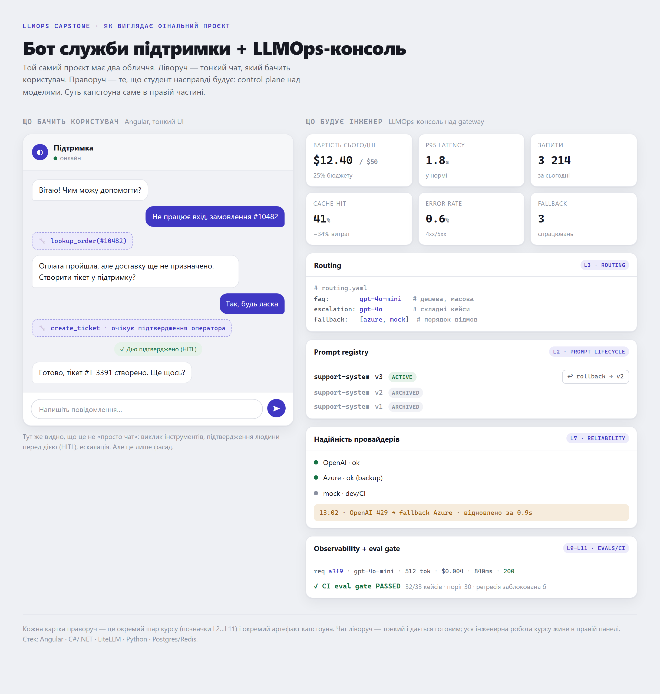
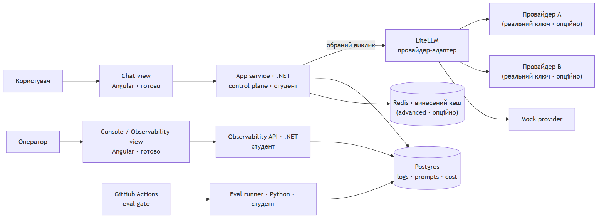
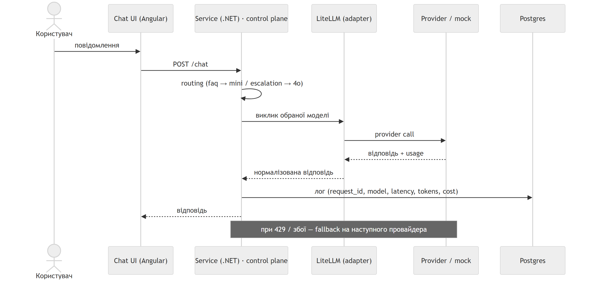
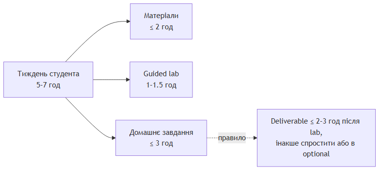
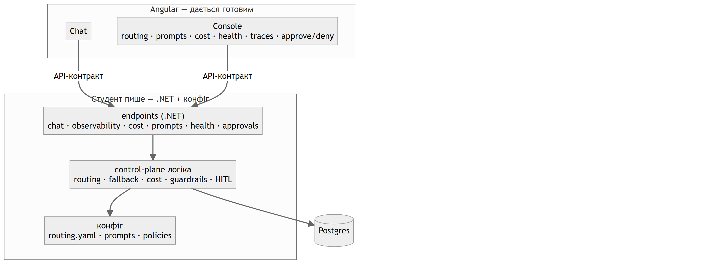

# LLMOps Engineering Bootcamp — capstone & starter

Матеріали наскрізного capstone-проєкту курсу: **support / helpdesk bot з LLM control plane**.
Студент отримує готовий каркас і добудовує control plane до production-рівня.

## Огляд

**Як виглядатиме застосунок**

**Архітектура**

**Request flow**

**Навантаження студента (на тиждень)**

**Контрол-плейн: хто що пише**

Джерела діаграм (mermaid, рендеряться на GitHub): [architecture](docs/architecture.md) · [request-flow](docs/request-flow.md) · [student-load](docs/student-load.md) · [control-plane](docs/control-plane.md).

## Стек

| Шар | Технологія |
|---|---|
| UI (чат) | Angular — тонкий, дається готовим |
| Сервіс | C# / .NET — control plane (routing, fallback, cost, policies) |
| Gateway | LiteLLM — провайдер-адаптер (єдиний виклик + нормалізація) |
| Evals | Python |
| Сховище / кеш | Postgres + Redis |
| CI | GitHub Actions — eval gate |
| Рантайм | Docker Compose (локально) |

LiteLLM виступає провайдер-адаптером: єдиний виклик до моделей і нормалізація провайдерів.
Routing, fallback, cost і policies студент пише в сервісі.

## Структура

- `docs/` — архітектура, request flow, тижневі outcomes, failure scenarios
- `starter/` — те, що клонує студент: каркас, mock provider, базові конфіги

## Мінімальний стек для запуску

LiteLLM + Postgres + сервіс + mock, зібрані через `docker compose up`.
Redis, дашборди й реальний ключ провайдера — опційно.

## Статус

Draft для strategy sync. Reference solution ще не додано — окрема private-гілка після узгодження власника репозиторію.
