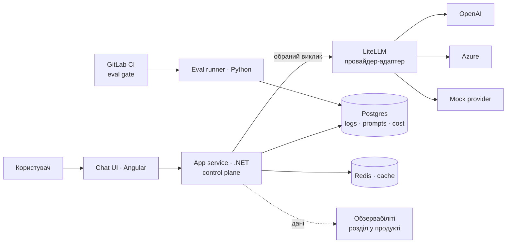

# Архітектура capstone

Support / helpdesk bot з LLM control plane. Control plane (routing, fallback, cost, policies)
живе в .NET-сервісі; LiteLLM виступає провайдер-адаптером.

## Хто що робить

- **UI (Angular)** — тонкий фасад, дається готовим, студент не змінює.
- **Сервіс (.NET)** — мозок: routing (яку модель обрати), fallback, cost-облік, guardrails, HITL-approval, розділ обзервабіліті.
- **LiteLLM** — єдиний виклик до будь-якого провайдера + нормалізація відмінностей. Логіки рішень не тримає.
- **Postgres** — логи запитів (`request_id`, model, latency, tokens, cost, prompt_version), prompt registry, cost records.
- **Redis** — кеш (опційно, з уроку про caching).
- **Eval runner (Python)** — golden dataset, graders, пороги.
- **GitLab CI** — eval gate, блокує regression.
