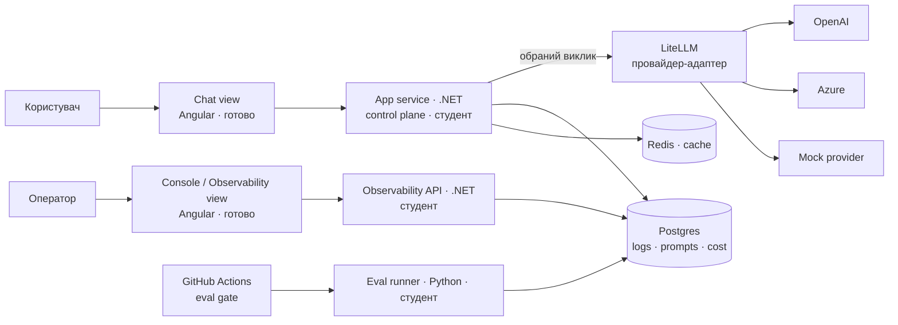

# Архітектура capstone

Support / helpdesk bot з LLM control plane. Control plane (routing, fallback, cost, policies)
живе в .NET-сервісі; LiteLLM виступає провайдер-адаптером.

Angular-застосунок має два розділи: **Chat** (користувач) і **Console / Observability** (оператор).
Обидва дають готовими — студент фронтенд не пише. Логіка живе в .NET: control plane (chat) і
observability API (console). Обзервабіліті — це console-розділ поверх .NET-API, який читає логи з Postgres.

## Хто що робить

- **Angular (готово)** — дві в'юхи: Chat і Console/Observability. Тонкі, даються готовими, студент їх не змінює.
- **App service (.NET, студент)** — control plane: routing, fallback, cost-облік, guardrails, HITL-approval.
- **Observability API (.NET, студент)** — читає логи з Postgres, віддає агрегати (traces, p95, cost, error-taxonomy) у Console-в'юху. Це і є «розділ обзервабіліті» — дані й логіка на бекенді, показ у готовій Angular-консолі.
- **LiteLLM** — єдиний виклик до будь-якого провайдера + нормалізація відмінностей. Логіки рішень не тримає.
- **Postgres** — логи запитів (`request_id`, model, latency, tokens, cost, prompt_version), prompt registry, cost records.
- **Redis** — кеш (опційно, з уроку про caching).
- **Eval runner (Python, студент)** — golden dataset, graders, пороги.
- **GitHub Actions** — eval gate, блокує regression.

Межа «Angular готовий ↔ .NET студента через API-контракт» детально: [control-plane.md](control-plane.md).
