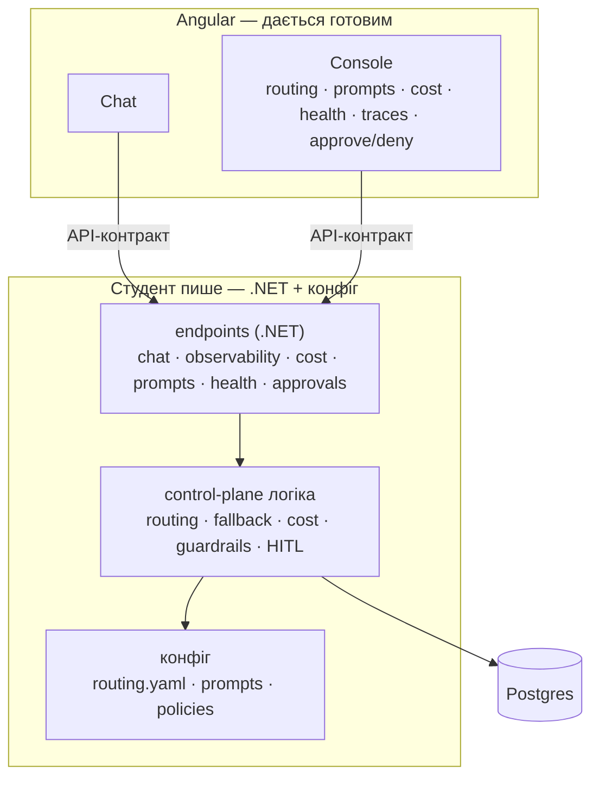

# Контрол-плейн: що це і хто що пише

Контрол-плейн — це **не Angular-застосунок**. Це бекенд + конфіг:
логіка на .NET (routing, fallback, cost, guardrails, HITL), конфіги
(`routing.yaml`, промпти, policies) і дані в Postgres. Оце будує студент.

Angular дає дві **готові** в'юхи — Chat і Console. Console — це вітрина контрол-плейну:
показує routing, версії промптів, cost, provider health, traces і має кілька дій
(approve / deny, promote / rollback). Вона зібрана наперед під **контракт API** .NET-ендпоінтів;
студент реалізує ці ендпоінти — і консоль оживає його даними.

Щоб не було плутанини:

- студент пише **.NET + конфіг**, ніколи Angular;
- зміни в контрол-плейні (promote промпта, зміна routing) — через **конфіг / API**, а не через побудову UI;
- консоль лише викликає .NET-API студента.

