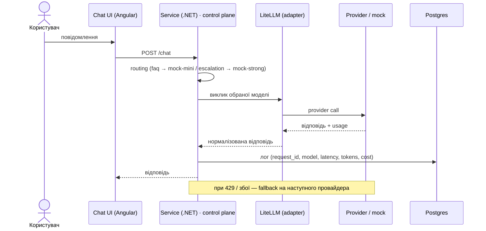

# Мінімальний request flow

Крок за кроком (мінімальний сценарій із брифу):

1. Користувач надсилає повідомлення.
2. Запит проходить через сервіс (control plane).
3. Сервіс обирає provider / model і викликає його через LiteLLM.
4. Логуються latency, tokens, cost.
5. При падінні провайдера спрацьовує fallback.
6. Tool-call перед незворотною дією потребує human approval.
7. Eval runner перевіряє якість.
8. CI блокує regression.
