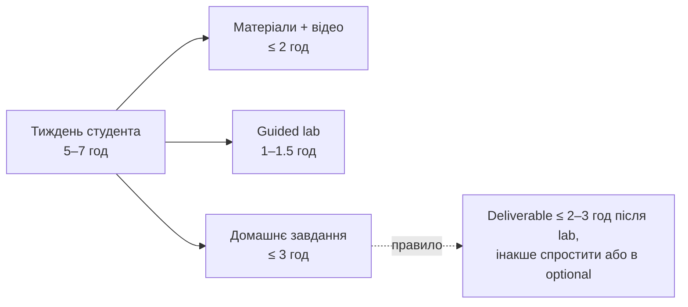

# Навантаження студента на тиждень

Орієнтир із брифу (§7). Стеля домашнього завдання — 3 год; тижневий deliverable має
вкладатися у 2–3 год після guided lab, інакше його спрощують або переносять в optional.

Це навантаження **студента**, не експерта. Розкладку часу по кожному тижню див. у
[weekly-outcomes.md](weekly-outcomes.md).
