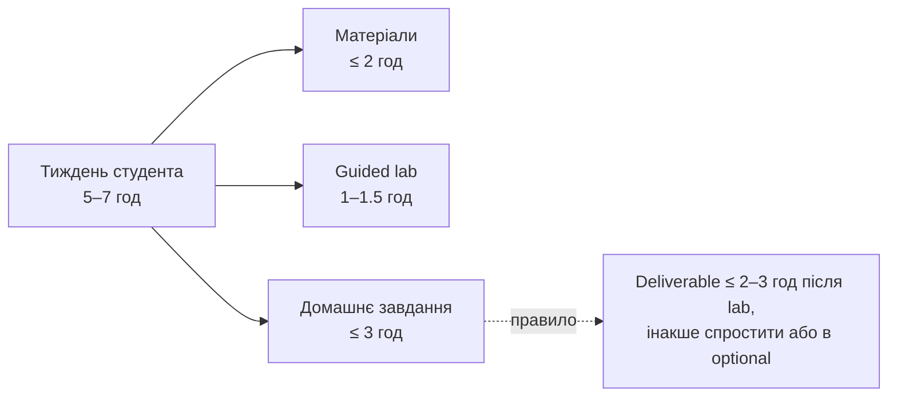

# Тижневі outcomes і оцінка часу

Бюджет на **студента**: матеріали ≤2 год, guided lab 1–1.5 год,
домашнє ≤3 год. Правило: якщо deliverable не робиться за 2–3 год після lab —
спростити або перенести в optional. Час нижче — це домашня частина **після** lab.

## Розкладка по тижнях

| Тиждень | Під-задача | Час, год | Ядро / опц |
|---|---|---|---|
| **W1** | scaffold + перший запит service → LiteLLM → mock | 0.5 | core |
| | розібрати готове логування (id/model/latency/tokens/cost → Postgres — уже працює в стартері, студент читає код) | 0.5 | core |
| | prompt registry (seed реєстру + версія + promote/rollback + у лог) | 1.0–1.5 | core |
| | **разом** | **~2–2.5** | ок |
| **W2** | routing (модель за задачею, конфіг) | 1.5 | core |
| | cost attribution (+ фіксація fallback-порядку) | 1.5 | core |
| | budget-alert / деградація за бюджетом | 0.5 | optional |
| | provider normalization — дає адаптер зі стартера | ~0 | core |
| | **разом (core)** | **~3** | ок після трима |
| **W3** | cache відповідей + лічильники hit/miss | 1.0 | core |
| | tool-виклик (read-only) + рішення timeout/idempotency у PR | 1.0–1.5 | core |
| | TTL / semantic cache / реалізація timeout | — | optional |
| | **разом** | **~2–2.5** | ок |
| **W4** | fallback chain (429 / 5xx → наступний провайдер) | 1.5 | core |
| | human approval перед незворотною дією | 1.0 | core |
| | маскування PII (email) на вході | 0.5 | core |
| | circuit breaker | 1.0 | optional |
| | guardrails (injection-детект) | 1.0 | optional |
| | **разом (core)** | **~3** | ок після трима |
| **W5** | observability-ендпоінти (/observability, /providers) | 1.0 | core |
| | розширення golden dataset (+4 кейси) + поріг + перевірка на фальш-позитиви | 1.0 | core |
| | таксономія помилок / LLM-as-judge | — | optional |
| | **разом (core)** | **~2.5–3** | ок після трима |
| **W6** | CI eval gate (run.py у GitHub Actions, блок за порогом) | 1.0 | core |
| | incident demo (outage → fallback → recovery) | 1.0 | core |
| | впорядкування repo / README + 30-day rollout (начерк — з лаби L12) | 0.5–1 | core |
| | **разом** | **~2.5–3** | ок |

## На кінець тижня студент має

- **W1** — піднятий стек; запит проходить через сервіс, логуються id/model/latency/tokens/cost; промпт версіонується.
- **W2** — routing «faq → mock-mini / escalation → mock-strong» + зафіксований fallback-порядок; cost/request і бюджет на консолі (алерт — опційно).
- **W3** — кеш із лічильниками; tool-виклик виконується, timeout/ключ ідемпотентності зафіксовані як рішення.
- **W4** — AI-фіча переживає падіння провайдера; незворотна дія — через human approval; email маскується до виклику моделі.
- **W5** — жива консоль (усі плитки) + повторюване оцінювання проти розширеного golden dataset.
- **W6** — CI блокує regression; демо інциденту з fallback; зібраний фінальний repo + 30-day rollout план.

## Фактичне навантаження на читання (виміряно)

Обсяг лонг-рідів не нормується стелею — урок закінчується там, де тема
висвітлена. Рівність тижнів тримається не однаковою довжиною, а сумарним
навантаженням: читання + лаби + ДЗ.

| Тиждень | Лонг-ріди, слів | Разом | Читання | 2 лаби | ДЗ |
|---|---|---|---|---|---|
| **W1** | L01 3197 + L02 3860 | 7057 | ~47 хв | ~25 хв | ≤3 год |
| **W2** | L03 3612 + L04 3162 | 6774 | ~45 хв | ~25 хв | ≤3 год |
| **W3** | L05 3467 + L06 3491 | 6958 | ~46 хв | ~25 хв | ≤3 год |
| **W4** | L07 3590 + L08 3768 | 7358 | ~49 хв | ~25 хв | ≤3 год |
| **W5** | L09 4051 + L10 3329 | 7380 | ~49 хв | ~25 хв | ≤3 год |
| **W6** | L11 3582 + L12 3644 | 7226 | ~48 хв | ~25 хв | ≤3 год |

Читання рахується консервативно, по 150 слів/хв для технічного тексту
українською. Тижневий підсумок — 4–5 год, у межах бюджету 5–7 год.

Розкид між тижнями — **±5%** (6774–7380 слів). Досягнуто не обрізанням, а
двома рішеннями: орієнтація в курсі переїхала з уроку 1 на сторінку змісту, а
тонкі уроки дописані там, де в них справді бракувало тем.

Навантаження за кодом навмисно нерівне і компенсує криву входу: **hw1
найлегший** (логування вже працює в стартері — студент наповнює реєстр і
дописує два ендпоінти), найважчий — **hw4** (fallback + HITL), коли людина вже
освоїлася зі стеком.

Правило на майбутнє: якщо тиждень вибивається більш ніж на ±20% за читанням
**і** має важке ДЗ — переносити треба ДЗ, а не різати матеріал.

## Тримінг перевантажених тижнів

Без тримів W2, W4, W5 перевищують 3 год. Тримаємо їх у бюджеті так:

- **W2** — provider normalization майже повністю дає LiteLLM-адаптер; core = routing + cost; budget-політика — optional.
- **W3** — реалізація timeout та ідемпотентності — optional; core фіксує ці рішення текстом у PR.
- **W4** (найважчий) — core = fallback + human approval + маскування PII (email); circuit breaker і injection-guardrail — optional.
- **W5** — core = observability-ендпоінти + розширення готового runner-а кейсами; таксономія і judge — optional.

Мета: кожен тиждень — один чіткий core-deliverable ≤3 год, решта в optional.
